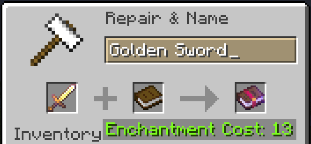

# Disenchantment

This plugin enhances the vanilla enchanting system by adding powerful, intuitive new functions to the standard anvil. Give your players the tools they need to manage their enchantments efficiently, without adding any new blocks or complex systems.

## Core Features

### Disenchanting: Reclaim Your Enchantments

Ever found a nearly-broken tool with a rare enchantment you wish you could save? Our disenchanting mechanic provides a straightforward solution

- **Simple Anvil Process**: A player places the enchanted item in the first anvil slot and a book in the second
- **Controlled Transfer**: For a configurable XP cost, the enchantment is removed from the item and transferred to the book, leaving the original item clean. This allows players to salvage valuable enchantments from worn-out or obsolete gear

 

### Book Splitting: Divide Your Enchanted Books

Need just one enchantment from a book with many? The Book Splitting feature allows for precise, strategic use of your enchanted books

- **Intuitive Splitting**: By combining a multi-enchantment book with a blank book on the anvil, players can lift a single enchantment off the original
- **Strategic Application**: This results in two books: the original with one less enchantment, and a new book with the single enchantment that was split off. This allows for targeted application and creates a more dynamic server economy

 

### Why Choose This Plugin?

- **Truly Vanilla-Friendly**: No new machines or confusing UIs. All functions are handled through the standard anvil
- **Lightweight & Efficient**: Adds valuable features without causing server lag or performance issues
- **Fully Customizable**: Easily configure XP costs and other settings to ensure perfect game balance
- **Practical Gameplay**: Improves the enchanting system by removing frustration and adding a layer of strategic choice

 

## Currently Supported Custom Enchantment Plugins

| Plugin                                                           | 1.21.7 - 1.21 | 1.20.6 - 1.20.5 | 1.20.4 - 1.18 |
|------------------------------------------------------------------|---------------|-----------------|---------------|
| [AdvancedEnchantments](https://www.spigotmc.org/resources/43058) | &check;       | &check;         | &check;       |
| [EcoEnchants](https://www.spigotmc.org/resources/79573)          | &check;       | &check;         | &check;       |
| [EnchantsSquared](https://www.spigotmc.org/resources/86747)      | &check;       | &check;         | &check;       |
| [UberEnchant](https://www.spigotmc.org/resources/19448)          | &check;       | &check;         | &check;       |
| [ExcellentEnchants](https://www.spigotmc.org/resources/61693)    | &check;       | &cross;         | &cross;       |

**!** EcoEnchants needs to be built with these changes: [EcoEnchants#417](https://github.com/Auxilor/EcoEnchants/pull/417)

**!** Download already built v12.24.0 here: [Disenchantment Release v6.2.2](https://github.com/H7KZ/Disenchantment/releases/tag/v6.2.2)

 

## FAQ

- Visit the [FAQ.md](https://github.com/H7KZ/Disenchantment/blob/master/FAQ.md)

## Commands

- Visit the [COMMANDS.md](COMMANDS.md) file to learn when to use a specific command

 

## Permissions

- Visit the [PERMISSIONS.md](PERMISSIONS.md) file to learn more about permissions and their usecases

 

## Configuration

- Visit the [CONFIG.md](CONFIG.md) file to understand every setting this plugin has to offer

 

## Contributing

> To contribute to this repository, please follow the [CONTRIBUTING.md](CONTRIBUTING.md) file, thank you!

 
 

## Links

- [SpigotMC](https://www.spigotmc.org/resources/110741)
- [Modrinth](https://modrinth.com/plugin/disenchantment)
- [bStats](https://bstats.org/plugin/bukkit/Disenchantment/19058)
- [GitHub](https://github.com/H7KZ/Disenchantment)
