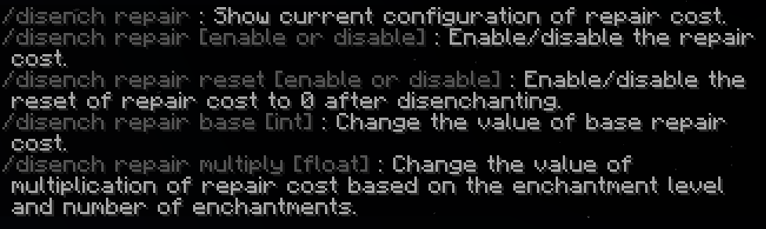
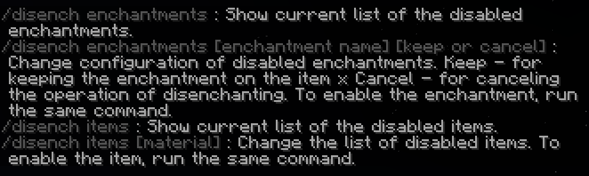
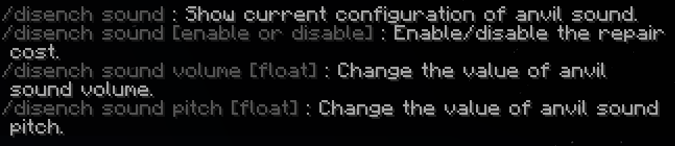

# Disenchantment

New mechanics for minecraft vanilla gameplay.
This plugin allows players to disenchant items and get the item's enchantments back.

- Tested minecraft versions:
  - `1.21`
  - `1.20.6`
- Tested custom enchantment plugins:
  - `ExcellentEnchants`
  - `EcoEnchants` (partially, you need to build the plugin from the source code with changes here: [EcoEnchants PR](https://github.com/Auxilor/EcoEnchants/pull/397))
  - `AdvancedEnchantments`

To be done:
- [ ] HIGH Also support grindstone disenchantment
- [ ] HIGH Add support for more custom enchantment plugins (UberEnchant, Enchants Squared, Crazy Enchantments)
- [ ] LOW ?? Add support for more minecraft versions (1.19) ??
- [ ] LOW API for developers (events, guis, etc.)

## Commands

> Command aliases:
> - `/disench`
> - `/disenchant`
> - `/disenchantment`

#### Command legend (syntax)

> - `[ ]` - Required
> - `( )` - Optional
> - `|` - Or
> - `' '` - Text
> - `< >` - Type
> - Types:
>   - `number` - Any number in format `12` or `14.3`
>   - `enchantment name` - Enchantment key (e.g. `flame`)
>   - `world name` - World name (e.g. `world_the_end`)
>   - `material name` - Material key (e.g. `diamond_sword`)

### Command list

- `/disenchantment` - Help
- `/disenchantment gui` - Open the settings GUI (RECOMMENDED WAY TO CHANGE SETTINGS)
- `/disenchantment help [<number>]` - Help page
- `/disenchantment status` - Is plugin enabled or disabled
- `/disenchantment toggle` - Enable or disable the plugin
- `/disenchantment toggle [<world name>]` - Enable or disable the plugin in a specific world
- `/disenchantment repair` - Get the repair settings
- `/disenchantment repair ['enable' | 'disable']` - Enable or disable the repair cost
- `/disenchantment repair reset ['enable' | 'disable']` - Enable or disable the repair cost reset
- `/disenchantment repair base [<number>]` - Set the base cost of disenchanting items
- `/disenchantment repair multiply [<number>]` - Set the multiplier when disenchanting items with multiple enchantments
- `/disenchantment enchantments` - Get the enchantments settings
- `/disenchantment enchantments [enchantment name] ('keep' or 'cancel')` - Set which enchantments are allowed to be removed
  - Enchantment command examples:
  - `/disenchantment enchantments [enchantment name]` - Remove the enchantment from the list
  - `/disenchantment enchantments [enchantment name] keep` - Enchantment will be kept on an item when disenchanting
  - `/disenchantment enchantments [enchantment name] cancel` - Entire disenchanting process will be canceled if item has this enchantment
- `/disenchantment materials` - Get the materials settings
- `/disenchantment materials [<material name>]` - Set which materials are not allowed to be disenchanted
- `/disenchantment sound` - Get the sound settings
- `/disenchantment sound ['enable' | 'disable']` - Enable or disable the anvil sound
- `/disenchantment sound volume [<number>]` - Set the anvil sound volume
- `/disenchantment sound pitch [<number>]` - Set the anvil sound pitch

## Permissions

- `disenchantment.all` - Access to all permissions
- `disenchantment.anvil` - Allows the player to disenchant items
- `disenchantment.command.gui` - GUI command
- `disenchantment.command.help` - Help command
- `disenchantment.command.status` - Plugin status
- `disenchantment.command.toggle` - Toggle command
- `disenchantment.command.repair` - Repair command
- `disenchantment.command.enchantments` - Enchantments command
- `disenchantment.command.materials` - Materials command
- `disenchantment.command.sound` - Sound command
- `disenchantment.gui.status` - GUI Enable or disable the plugin
- `disenchantment.gui.toggle` - GUI Enable or disable the plugin in a specific world
- `disenchantment.gui.repair` - GUI Set the repair settings
- `disenchantment.gui.enchantments` - GUI Set the enchantments settings
- `disenchantment.gui.materials` - GUI Set the materials settings
- `disenchantment.gui.sound` - GUI Set the sound settings

## Features

- GUI for settings
- Enable or disable the disenchanting of items
- Set which worlds are allowed to disenchant items
- Set which materials are allowed to disenchant
- Set which enchantments are allowed to be removed or kept
- Enable or disable the disenchanting cost
- Set the base cost of disenchanting items
- Set the multiplier when disenchanting items with multiple enchantments
- Enable or disable the anvil sound
- Set the anvil sound volume
- Set the anvil sound pitch
- Enable or disable console logging (INFO or DEBUG)

## How to disenchant items

## Help pages

 
 

#### Links
- [SpigotMC](https://www.spigotmc.org/resources/110741)
- [bStats](https://bstats.org/plugin/bukkit/Disenchantment/19058)
- [GitHub](https://github.com/H7KZ/Disenchantment)
- [ExcellentEnchants](https://www.spigotmc.org/resources/61693)
- [EcoEnchants](https://www.spigotmc.org/resources/79573)
- [AdvancedEnchantments](https://www.spigotmc.org/resources/43058)

